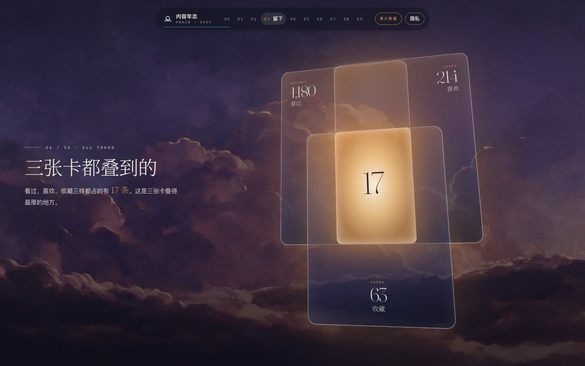
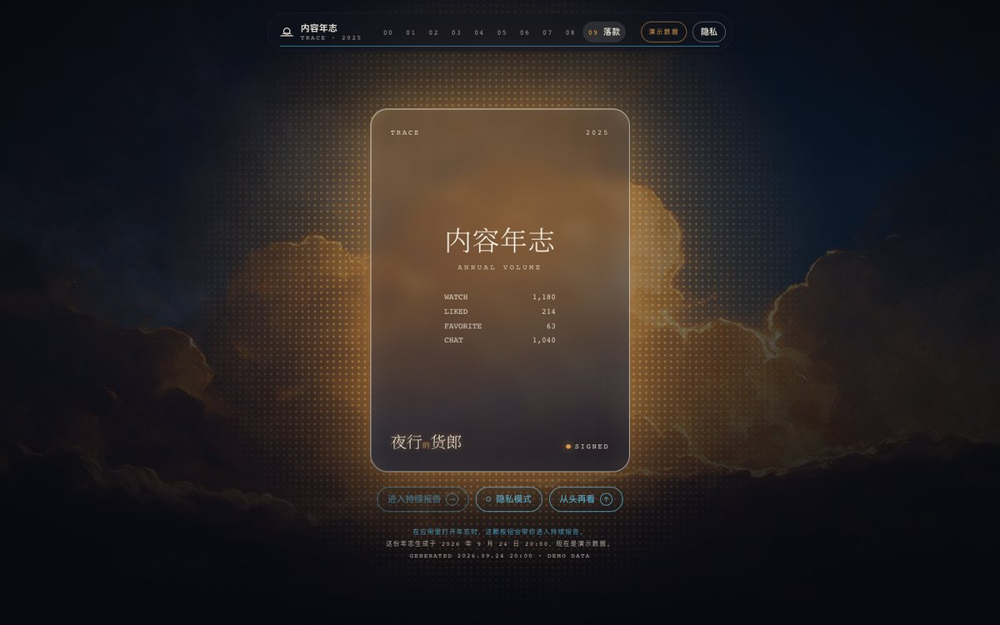
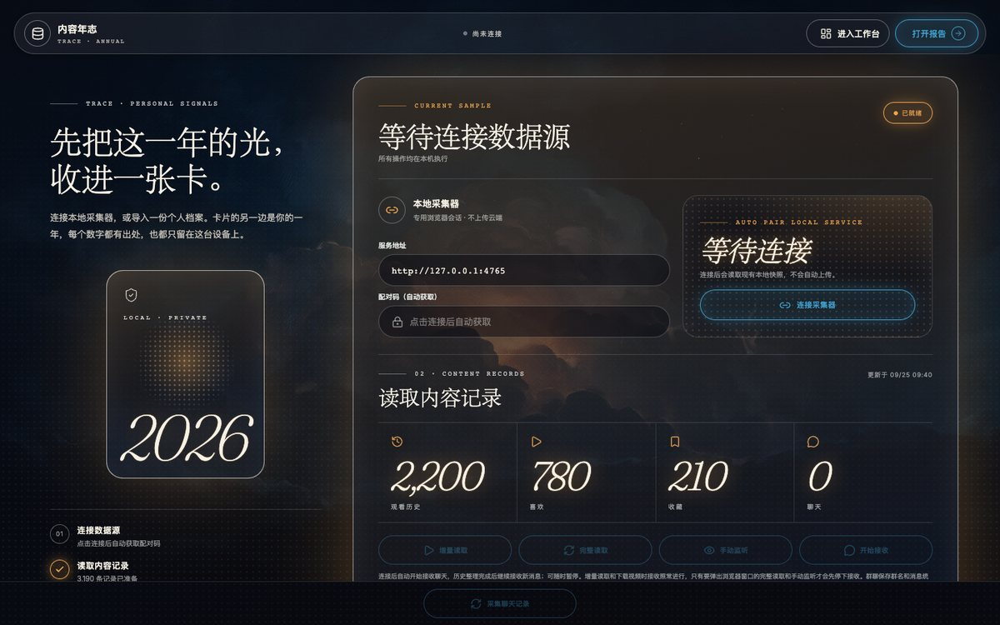
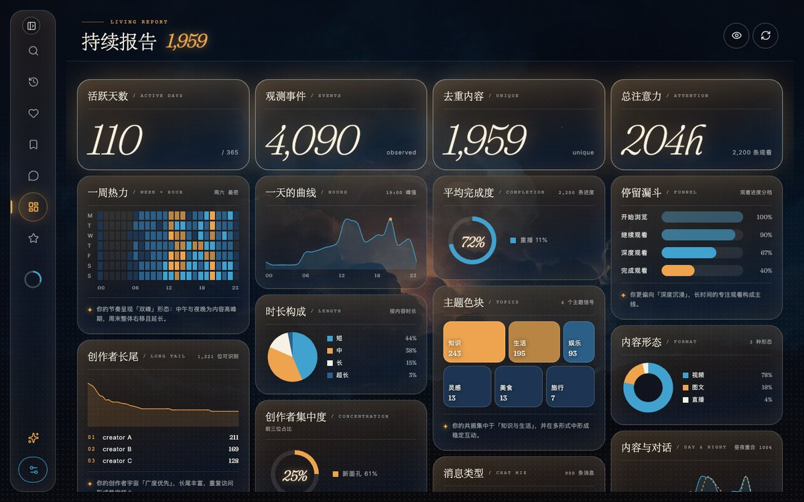
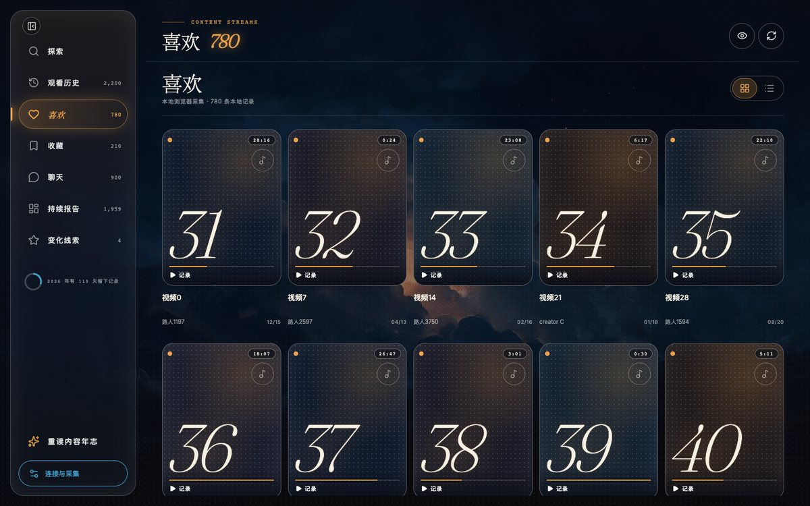
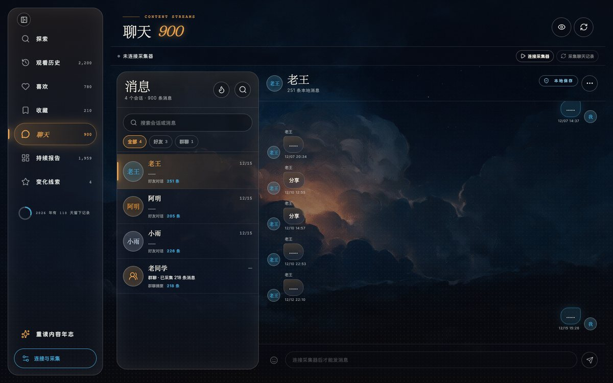

<div align="center">
  <a href="https://github.com/ZhangYukwiver/DouyinDataReview/releases/latest"></a>
  <h1>DouyinDataReview | 内容数据工作台</h1>
  <p><strong>把抖音这一年，留在自己的电脑上</strong></p>
  <p>一个面向开发者和个人用户的<strong>本地优先</strong>抖音数据回顾工作台。<br>
  它把观看、喜欢、收藏和聊天记录带到本机离线查看，生成可交互的持续报告与年度回顾，也支持聊天实时接收、探索工作台和桌面安装包。</p>
  <p>不接外部 AI：标题、作者、封面、Cookie 和报告都不会发送到任何外部分析服务。</p>
  <p>问题反馈与交流请联系 QQ 940537208，或加入 QQ 群 DDDouyin（群号 1124211302），见<a href="#交流与反馈">交流与反馈</a>。</p>
  <p>
    <a href="https://github.com/ZhangYukwiver/DouyinDataReview/releases/latest"></a>
    <a href="https://github.com/ZhangYukwiver/DouyinDataReview/blob/main/LICENSE"></a>
    <a href="https://github.com/ZhangYukwiver/DouyinDataReview/actions/workflows/desktop-release.yml"></a>
    <a href="https://github.com/ZhangYukwiver/DouyinDataReview/stargazers"></a>
    <a href="https://github.com/ZhangYukwiver/DouyinDataReview/releases"></a>
    <a href="https://github.com/ZhangYukwiver/DouyinDataReview/network/members"></a>
    <a href="#交流与反馈"></a>
  </p>
</div>

<p align="center"><a href="https://github.com/ZhangYukwiver/DouyinDataReview/releases/download/v0.1.10/poster-2025-demo.mp4">▶ 直接查看演示视频（MP4）</a></p>

<p align="center"><a href="https://github.com/ZhangYukwiver/DouyinDataReview/releases/latest">下载桌面版</a> · <a href="#面向开发者">从源码运行</a> · <a href="https://github.com/ZhangYukwiver/DouyinDataReview/stargazers">觉得有用就 Star</a></p>

<p align="center"><sub>海报风格的年度回顾，从封面一路滚到落款。视频和截图都是合成示例数据；这是可切换的其中一种视觉风格。</sub></p>

> **先看什么？** 想安装，直接打开[最新 Release](https://github.com/ZhangYukwiver/DouyinDataReview/releases/latest)；想了解实现，查看[面向开发者](#面向开发者)；想比较另一种视觉风格，继续看下面的[年度回顾](#年度回顾)。

> [!NOTE]
> 本机需要已安装 Chrome、Edge、Brave 或 Chromium 中的任意一个（Windows 自带的 Edge 即可；macOS 上也能自动识别 Comet）。工具只读取你本人登录账号在网页端当前可见的记录；增量读取走的是抖音未公开承诺的私有接口，可能失效或触发账号风控，只用于本机个人账号。详见[采集原理与边界](#采集原理与边界)。

## 主要功能

- 本地读取观看历史、喜欢、收藏和聊天记录，默认无界面增量更新
- 聊天实时接收，能直接回复好友、看好友在线状态；续火花看板提醒今天还没续的火花
- 内容库按记录浏览，视频可下载到本地、在应用内播放
- 持续报告：默认看最近 30 天，和上一段比较变化
- 年度回顾：内容年志和海报两种风格，读的是同一份本地汇总
- 探索工作台：复用登录会话搜索用户与内容，可点赞、收藏、关注、评论

## 年度回顾

在「连接与采集」页的「整体风格」里挑一种，再点「打开报告」。风格同时决定采集器页和工作台的样子。

- **内容年志**（默认）：先看到一张入口卡，写着观看、喜欢、收藏、聊天各有多少条；点卡片穿过去，是一卷十章的夜色长卷，天色随章节在五个时辰的油画之间变换。
- **海报**：墨黑、新闻纸配信号橙的展览海报，十章硬切长卷，就是上面演示视频中的一种视觉风格。

<table>
  <tr><td></td><td></td></tr>
  <tr><td></td><td></td></tr>
  <tr><td></td><td></td></tr>
</table>

> 报告只用记录里明确带着的作者、话题、音乐、时长和互动数，不接外部 AI 推测兴趣，也不做心理诊断。视频的「词条」只取显式话题标签；聊天高频词用浏览器内置的 `Intl.Segmenter` 分词，先剔除平台模板消息，群聊正文不参与。

<details>
<summary>工作台截图：连接与采集、持续报告、内容库、聊天（点击展开）</summary>

<table>
  <tr><td></td><td></td></tr>
  <tr><td></td><td></td></tr>
</table>

连接与采集页点「连接采集器」会自动取配对码；内容库的卡片可以下载视频、在应用内播放；聊天页的新消息实时进来，列表头的火苗按钮打开续火花看板，群聊只给统计摘要。

</details>

## 支持平台与设备

| 平台 | 设备 / 架构 | 安装包 |
| --- | --- | --- |
| Windows | x64 | `ContentInsights-Setup-<version>.exe`（NSIS 安装器） |
| macOS | Apple Silicon（arm64） | `ContentInsights-<version>-arm64.dmg` |

两个安装包都没有开发者签名，首次打开的处理方式见下面「快速开始」。手机端通过同一局域网连接电脑上的采集器使用，见[面向开发者](#面向开发者)末尾的[手机连接](#手机连接)小节。

## 快速开始

1. 打开[最新 Release](https://github.com/ZhangYukwiver/DouyinDataReview/releases/latest)，按上表下载对应安装包。

   **macOS 首次打开前需在终端执行一次 `xattr -cr "/Applications/内容数据工作台.app"`，否则会提示应用已损坏；Windows 可能出现 SmartScreen 提示，点「更多信息」，再点「仍要运行」。**

2. 启动「内容数据工作台」，点击「连接采集器」。应用会从本机采集器自动取一次性配对码完成连接，之后默认在前台自动读取新记录，也可以手动点「增量读取」。
3. 首次连接时独立浏览器还没登录，会自动开始一次完整读取并弹出浏览器窗口，在里面登录自己的抖音账号；登录后自动继续，之后整理聊天历史并保持实时接收。
4. 进入内容库，在观看历史、喜欢、收藏、聊天和持续报告之间切换；在「整体风格」里选内容年志或海报，点「打开报告」看年度回顾。

> 安装包只含应用代码、Web 页面和已校验的签名器，不含本地记录、登录状态或浏览器配置。采集记录保存在 macOS 的 `~/Library/Application Support/内容数据工作台/collector/` 或 Windows 当前用户的应用数据目录，升级不会覆盖。
>
> 桌面版启动后会检查 GitHub Release，有新版本时在「连接与采集」页下载，下载完点「重启并安装」；采集进行中不会自动重启。

想看每个模块能做什么，去[详细功能清单](#详细功能清单)；出了问题，先看[常见问题](#常见问题)；要从源码跑、自己打包或用手机连，看[面向开发者](#面向开发者)。

## 详细功能清单

| 功能模块 | 说明 |
| --- | --- |
| **增量读取（默认）** | 走无界面接口读新记录：每个分类第一次读全部可见记录并记下边界，之后只读到本地已知记录为止。读一段存一段，工作台边读边能看到新记录，不用等整轮跑完 |
| **前台自动增量读取** | 连接采集器后默认开启，应用回到前台就复用增量接口更新视频记录。可以在连接与采集页的开关里暂停；读取期间聊天照常接收，应用关掉后不常驻 |
| **完整读取** | 依次定位观看历史、喜欢、收藏三个主页面，在真实可滚动区域一边滚一边去重合并，直到接口明确返回末页 |
| **手动监听** | 打开独立浏览器由你自己浏览，采集器只保存监听期间真正出现、它认得的那几类网页响应 |
| **聊天实时接收** | 连接后在后台整理会话目录和好友历史，工作台显示进度；整理完后保持连接，新消息自动入库，随时可以暂停或重新开始。好友对话保存完整消息字段（含分享评论和内置小表情），群聊只保存群名和统计。聊天页还会显示好友在线状态 |
| **续火花看板** | 聊天页列表头的火苗按钮打开一个只读看板，角标是今天还没续的火花数。看板分四组：今天还没续、今天续上了、快点亮了、最近断了；每行给最近 14 天的小方格（实心是双方都发过，浅色是只有一方），亮着但今天还没续的显示离零点还剩多久，点一行直接跳到那个会话。天数按本机保存的聊天记录估算：同一天你们都发过消息才算一天，连着聊满 3 天点亮，断一天清零；抖音没公开算法，数字只当参考。看板只看不发，不会替你自动发消息续火花 |
| **聊天发送** | 在好友会话里发文字和内置小表情，以网页返回的服务器消息编号确认送达，一律不自动重发。接收中且历史整理完才能发；群聊、隐私模式下不能发，暂不支持图片和视频 |
| **探索** | 复用采集器已有的登录会话搜索用户与内容，不额外启动浏览器；已就绪的手动监听和聊天接收可以和搜索并行。看主页、作品详情和评论，可点赞、收藏、关注、评论，并在应用内播放 |
| **内容库** | 观看历史 / 喜欢 / 收藏 / 聊天 / 持续报告五个页面；采集进行中也能打开，结束后自动换成新数据。记录卡片可把视频下载到本地并在应用内播放；桌面 Web 里点「批量下载」可在网格或列表多选、全选，再下载并保存为 ZIP（每批最多 50 个、合计 500 MB） |
| **持续报告** | 不用先选年份，也不要求每条记录都有行为时间；默认观察最近 30 天，样本不足时回退 90 天，并和上一段比较变化 |
| **年度回顾** | 内容年志：穿卡入口 + 十章夜色长卷；海报：十章黑橙硬切长卷。两种都按写入浏览器本地的同一份汇总快照渲染，没有数据时显示演示样本 |
| **整体风格** | 一键切换，同时决定采集器页、内容库和报告本体的配色、字体与版式；选择保存在浏览器本地 |
| **切换账号** | 清除独立浏览器里的抖音会话和本地记录，然后等你登录另一个账号 |
| **导出与导入** | 连接与采集页可以把采集器里的观看、喜欢、收藏和聊天导出成一个 JSON 文件。导入这份文件或官方个人信息下载的 JSON / ZIP 后，报告和工作台先用文件里的数据，点「移除」就换回采集器；本应用导出的文件还能「并入本机记录」，只补本机没有的记录，之后增量读取接着往上加，换电脑或清过记录后可以这样恢复 |
| **手机连接** | 电脑端启用 LAN 模式后，同一可信局域网内的手机可以用一次性配对码连接 |

## 采集原理与边界

### 为什么还会滚动页面

和你自己在浏览器里翻记录一样，只是由程序代你翻页并存到本地。接口请求是抖音自己的页面脚本带着登录态和签名发出去的，采集器只监听这些响应，不伪造 Cookie、`a_bogus`、`X-Bogus` 或其他私有签名。所以完整读取得先找到对的列表，在它真正能滚的那块区域往下滚，让网页自己去加载下一批，直到接口明确说到底了。若页面无法继续滚动、游标不前进或响应重复，本次列表会标记为不完整，并保留已有完整数据。完整读取不会绕过验证码或安全提示；页面结构或响应格式变化时会返回明确错误，不会把无法读取误报为空列表。

### 无界面增量读取

复用独立浏览器的登录态，使用真正的 Chrome 无头模式，不弹窗口、不出现在任务栏。观看历史逐页直接请求接口；喜欢和收藏由抖音页面运行时生成当前签名并在后台自动滚动。每个分类完成后立即合并保存，后续分类失败不会撤销已完成分类。签名器来自 `mafqla/douyin-api@42987a1`，安装时逐文件校验 SHA-256 并保存在已忽略的 `.local-data/direct-signer/`；macOS 用系统沙箱禁止签名进程联网和写文件，Windows 用 Node 权限模型禁止写文件、创建子进程和 Worker。页面刚打开时偶尔会先回一次 401/403，采集器会接着等同一次加载里的有效响应；要是游标不对、页面重复、碰到 429 或平台返回非零状态，这个分类就整个不保存，不留半截结果。

第一次使用或浏览器标识变化时，增量配置还没有建立，应用会自动回退一次完整读取来完成登录并捕获页面请求模板；这一次可能打开独立浏览器。配置建立后，增量读取和前台自动读取均保持无头运行；完整读取失败不会再次自动弹窗。

<details>
<summary>时间字段口径与各模块细节（点击展开）</summary>

### 时间字段口径

观看日期优先读取响应中的逐作品 `aweme_date` 映射并兼容 `history_info.view_time`；喜欢和收藏日期统一读取 `play_progress.last_modified_time`；两者缺失时保持为空，不会用发布时间或采集时间替代。观看进度优先用 `play_progress.play_progress` 与视频时长计算，采集器不会按进度阈值丢弃可识别记录。

### 各模块细节

- 增量读取：本地旧记录不会因为平台可见窗口缩短，或你取消点赞、取消收藏而被删掉。
- 聊天：接收、增量读取和视频下载共用同一个无头会话，各开各的页，三件事可以同时进行；只有要弹出浏览器窗口的完整读取和手动监听会先停下接收。
- 聊天发送：回车发送，Shift+回车换行。消息由正在接收的抖音网页代为输入并点发送，签名和传输都由网页自己完成；未过审核（只有自己可见）、被拒、没发出或结果不明会分别提示。
- 探索：读取可以取消，超时会停止；需要登录或验证时，会提示你去手动监听里处理。
- 批量下载：可以停止后续下载、继续未完成的和重试失败项；关闭前需要先保存 ZIP。

</details>

### 当前边界

- 增量读取走的是未经抖音公开文档承诺的私有接口，可能失效或触发账号风控；当前仅用于本机个人账号，不应作为公开、多用户或商业服务。
- 报告描述的是网页或接口当前可见并成功读取的记录，不保证覆盖抖音服务端未提供的更早历史。
- 暂不包含直播或影视综历史、收藏夹深度遍历、截图分享、PNG / PDF 导出。
- 续火花看板的天数是按本机记录估算的，可能和抖音里显示的对不上；工具不会自动发消息续火花，这属于平台禁止的自动化。
- Web 端提供持续报告、记录、聊天和数据源页面；手机原生端暂时只保留记录和数据源。

## 本地数据与接口

<details>
<summary>数据放在哪、本地接口和不落盘的内容（点击展开）</summary>

### 数据放在哪

从源码运行时数据在项目里的 `.local-data/`（已被 git 忽略）；桌面版在 macOS 的 `~/Library/Application Support/内容数据工作台/collector/` 或 Windows 当前用户的应用数据目录。

- 独立浏览器配置目录：`.local-data/browser-profile/`，保存着抖音登录态
- 直接读取模板：`.local-data/direct-history-template.json`，只含浏览器标识和白名单里的查询参数，不含 Cookie
- 归一化记录：`.local-data/records.json`
- 签名器：从源码运行时在 `.local-data/direct-signer/`，桌面安装包里已内置校验过的签名器
- 内容年志会把一份汇总快照写入浏览器本地（条数、按天与按小时的分布、交集、话题与创作者排行、聊天形态、高频词条等，不含原始记录、Cookie 或 Token），再以应用内同源页面打开入口卡
- 「清除本地记录」只删本地归一化记录和汇总快照，不清除登录状态，也不修改抖音账号里的观看、点赞或收藏状态

### 本地接口

本地服务默认监听 `127.0.0.1:4765`。

| 路径 | 作用 |
| --- | --- |
| `/v1/health` | 健康检查 |
| `/v1/pairing-code` | 仅向本机回环连接返回一次性配对码 |
| `/v1/pair` | 完成配对 |
| `/v1/sync` · `/v1/sync/stop` | 启动完整页面同步 · 停止当前读取 |
| `/v1/chat/observe` · `/v1/chat/observe/stop` | 开始聊天实时接收 · 暂停接收 |
| `/v1/chat/send` | 只在你点击发送时，在正在接收的抖音聊天页里输入并发出一条好友消息 |
| `/v1/explore/*` | 只在你点击探索页操作时才复用后台会话搜索、读取或互动 |
| `/v1/experimental/records-direct` | 只允许本机回环连接。默认的增量读取就走这里：直接读观看历史，喜欢和收藏在后台无界面采集 |
| `/v1/downloads` | 只在你点下载或播放时启动。下载会用无头会话把视频取回本地；播放只解析视频地址，不落盘。DELETE 释放播放任务 |
| `/v1/downloads/:id/stream` | 播放器边下边播用的转发地址，凭每个播放任务单独的 key 访问，不带登录令牌；任务释放后立即失效 |
| `/v1/observe` · `/v1/observe/stop` | 打开独立浏览器手动监听 · 停止监听 |
| `/v1/status` · `/v1/records` | 读取状态与归一化记录，DELETE 清除本地记录 |
| `/v1/account/switch` · `/v1/browser/close` | 切换账号 · 关闭独立浏览器 |

应用内取视频、读评论和用探索页时，会先禁止远端自动播放并拦截观看历史写入，视频只在应用内播放。

### 不落盘的内容

- 12 小时会话 Token 只保存在应用内存和请求头中，不进入 URL 或本地存储。
- 原始响应、请求头、Cookie、签名和完整诊断 URL 不会写入记录文件。

</details>

## 常见问题

### macOS 打开时提示应用已损坏？

安装包没有开发者签名。在终端执行一次 `xattr -cr "/Applications/内容数据工作台.app"`，再打开就行。

### Windows 弹出 SmartScreen？

点「更多信息」，再点「仍要运行」。

### 提示「未找到 Chrome、Edge、Brave 或 Chromium 浏览器」？

装上 Chrome、Edge、Brave 或 Chromium 中的任意一个（Windows 自带的 Edge 即可；macOS 上也能自动识别 Comet）；浏览器装在非默认位置时，可用环境变量 `DOUYIN_CHROME_PATH` 指定可执行文件路径。

### 首次连接弹出浏览器窗口，正常吗？

正常。独立浏览器还没登录时，会自动开始一次完整读取并弹出窗口让你登录；登录后自动继续。

### 已连接却提示「尚未捕获直接读取模板」？

请从[最新 Release](https://github.com/ZhangYukwiver/DouyinDataReview/releases/latest)升级至 v0.1.1 或更新版本。旧版手动监听可能保存了记录，却没有建立增量读取所需的配置。新版会在监听观看历史时保存配置；增量读取缺少配置或配置失效时，会自动尝试一次完整读取。若仍提示初始化失败，点击「完整读取」，在专用浏览器中登录并等待观看历史加载完成。升级会保留本地记录。

### 报告是空的，或提示「报告有更新」？

采集进行中也能打开报告，这时数据可能还不全；采集结束后会提示「报告有更新」并换成新数据。持续报告在最近 30 天样本不足时会自动回退到 90 天。

### 火花天数和抖音里显示的对不上？

看板按本机保存的聊天记录估算：同一天双方都发过消息才算一天，连着聊满 3 天点亮，断一天清零。抖音没公开自己的算法，而且本地只有采集到的那部分记录，所以数字只当参考；想改口径可以在源码 `src/domain/chatSparks.ts` 顶部改常量。

### 探索页提示需要登录或验证？

去「手动监听」里，在独立浏览器中把登录或验证做完，再回到探索页。

### 手机连不上？

电脑端启动采集器时要加 `--lan`，并用 `--origin` 写上手机实际打开的页面地址；手机上把服务地址改成采集器显示的局域网地址。完整命令见[手机连接](#手机连接)。

### 还有别的问题？

先翻一遍[采集原理与边界](#采集原理与边界)，没找到答案再到 [Issues](https://github.com/ZhangYukwiver/DouyinDataReview/issues) 或 QQ 群提问，见[交流与反馈](#交流与反馈)。

## 面向开发者

```bash
# 1. 克隆项目并安装依赖
git clone https://github.com/ZhangYukwiver/DouyinDataReview.git
cd DouyinDataReview
npm install

# 2. 安装并离线校验固定版本的签名器（增量读取需要）
npm run direct:setup
npm run direct:check

# 3. 启动采集器（终端 A）
npm run collector

# 4. 启动 Web 页面（终端 B），然后打开 http://localhost:8081 点「连接采集器」
npm run web
```

页面与采集器在同一台电脑时会自动获取并填入 8 位一次性配对码。

其他开发方式：

- macOS 一键启动：`npm run app:mac` 生成 `抖音年度回顾.app`，双击即可在后台启动采集器和页面；保持它与项目在同一目录，首次打开时允许访问「文稿」文件夹，从 Dock 退出会停止它启动的本地服务。它每次启动都会先跑一次 `expo export` 重新生成 `dist/` 再伺服，所以应用源码改动重开应用就能生效（每次启动都要先等一会儿构建）；但它不经过 `npm run build:web`，改了 `prototype/` 里的内容年志要先 `npm run sync:story`。
- Windows 桌面开发版：`npm run desktop` 会构建 Web 页面并启动 Electron 和仅监听本机的内置采集器。
- 进程看护：`npm run watch:process -- npm run web` 按秒采样子进程树，CPU 持续超过 500% 或 RSS 超过 2 GB 时自动停止。
- 验证：`npm run typecheck`、`npm test`、`npm run build:web`。
- 内容年志的源文件在 `prototype/`，改完运行 `npm run sync:story` 同步到 `public/story/`（`npm run build:web` 会自动同步）。

<details>
<summary>打包 exe / dmg 安装包，适合要自己出包的开发者查阅（点击展开）</summary>

**Windows（NSIS 安装器）**

```bash
npm run desktop:build
```

输出到 `release/ContentInsights-Setup-<version>.exe`，带桌面和开始菜单快捷方式。

**macOS（DMG）**

```bash
npm run desktop:build:mac
```

在 Apple Silicon Mac 上输出 `release/ContentInsights-<version>-arm64.dmg`。没有 Apple 开发者签名时会做 ad-hoc 签名，拿到 dmg 的人首次打开前仍要执行上面的 `xattr -cr`。

</details>

### 手机连接

电脑和手机要在同一个可信局域网。启动采集器时加 `--lan` 打开局域网访问，再用 `--origin` 写上手机实际打开的页面地址：

```bash
npm run collector -- --lan --origin http://192.168.1.20:8081
```

应用中把服务地址改为采集器显示的局域网地址，例如 `http://192.168.1.20:4765`。LAN 模式仍使用一次性配对码和内存会话，但流量是局域网 HTTP，只应在可信网络使用。

## 安全说明

1. **仅限个人使用**：此工具只读取你本人登录账号当前可见的记录，发消息、点赞、评论等操作也只在你手动点击时进行；请勿用于他人账号，也不要拿来批量或定时发送
2. **登录态安全**：独立浏览器配置目录保存着抖音登录 Cookie，请妥善保管，不要拷贝或分享给他人
3. **数据隐私**：本地记录和聊天快照包含个人隐私信息，请谨慎处理；仓库和安装包本身不含任何数据
4. **合法使用**：请遵守相关法律法规和平台规则，不得用于非法目的

## 免责声明

> [!IMPORTANT]
> 请在充分理解以下内容，并自愿承担相应责任的前提下使用本项目：
>
> 1. **项目性质**
>
>    本项目为独立开发的非官方开源工具，与抖音、字节跳动及其关联主体不存在隶属、授权、合作或认可关系。相关产品名称和商标归其权利人所有。
>
> 2. **合法使用**
>
>    本项目仅可用于处理使用者本人合法持有、管理或已经取得明确授权访问的数据。使用者应遵守适用的法律法规、软件许可协议、平台规则和隐私保护义务。
>
> 3. **数据与备份**
>
>    使用过程涉及本地记录、浏览器登录态、聊天快照和下载的视频文件。开始前请备份重要数据，并自行负责登录态保管、数据安全和隐私保护。
>
> 4. **兼容性与运行风险**
>
>    抖音页面结构、接口格式或风控策略变化，可能导致读取失败、功能失效、账号提醒或其他不可预期结果。本项目不保证对未来抖音版本持续兼容。
>
> 5. **责任范围**
>
>    本项目按现状提供，不对功能的准确性、完整性、稳定性或持续可用性作出明示或默示保证。在适用法律允许的范围内，因使用、误用、版本不兼容、操作中断或第三方策略变化产生的损失和后果，由使用者自行承担。
>
> 使用或继续使用本项目，即表示使用者已经阅读、理解并同意以上内容，并愿意对自己的操作及其结果负责。

## 交流与反馈

| 渠道 | 怎么用 |
| --- | --- |
| [GitHub Issues](https://github.com/ZhangYukwiver/DouyinDataReview/issues) | 报 bug、提需求，公开有记录，遇到过同样问题的人也能回答你 |
| QQ 群「DDDouyin」 | 群号 1124211302，讨论与互助 |
| QQ | 940537208，问题反馈与交流直接联系 |

提问前先看一遍[常见问题](#常见问题)和[采集原理与边界](#采集原理与边界)，并附上出问题时的操作步骤和系统版本，能省掉来回追问。

<p align="center"></p>

## 致谢

1. **[mafqla/douyin-api](https://github.com/mafqla/douyin-api)** — 固定版本签名器
2. **[Expo](https://github.com/expo/expo)** / **[React Native](https://github.com/facebook/react-native)** / **[react-native-web](https://github.com/necolas/react-native-web)** — 工作台页面与原生端
3. **[Electron](https://github.com/electron/electron)** / **[electron-builder](https://github.com/electron-userland/electron-builder)** — 桌面壳与安装包
4. **[Playwright](https://github.com/microsoft/playwright)** — 驱动独立浏览器与无头会话
5. **[lucide](https://github.com/lucide-icons/lucide)** — 图标

没有这些项目，这个工具做不出来，谢谢他们。

## 贡献

发现 bug、有功能诉求、觉得操作繁琐或界面不好看，都欢迎提 [Issue](https://github.com/ZhangYukwiver/DouyinDataReview/issues)；想动手改的话，fork 后发 [Pull Request](https://github.com/ZhangYukwiver/DouyinDataReview/pulls) 就行。

<a href="https://github.com/ZhangYukwiver/DouyinDataReview/graphs/contributors"></a>

## Star History

<picture>
  <source media="(prefers-color-scheme: dark)" srcset="https://api.star-history.com/svg?repos=ZhangYukwiver/DouyinDataReview&type=Date&theme=dark" />
  <source media="(prefers-color-scheme: light)" srcset="https://api.star-history.com/svg?repos=ZhangYukwiver/DouyinDataReview&type=Date" />
  
</picture>

<p align="center"><strong>请负责任地使用本工具，遵守相关法律法规。</strong></p>
