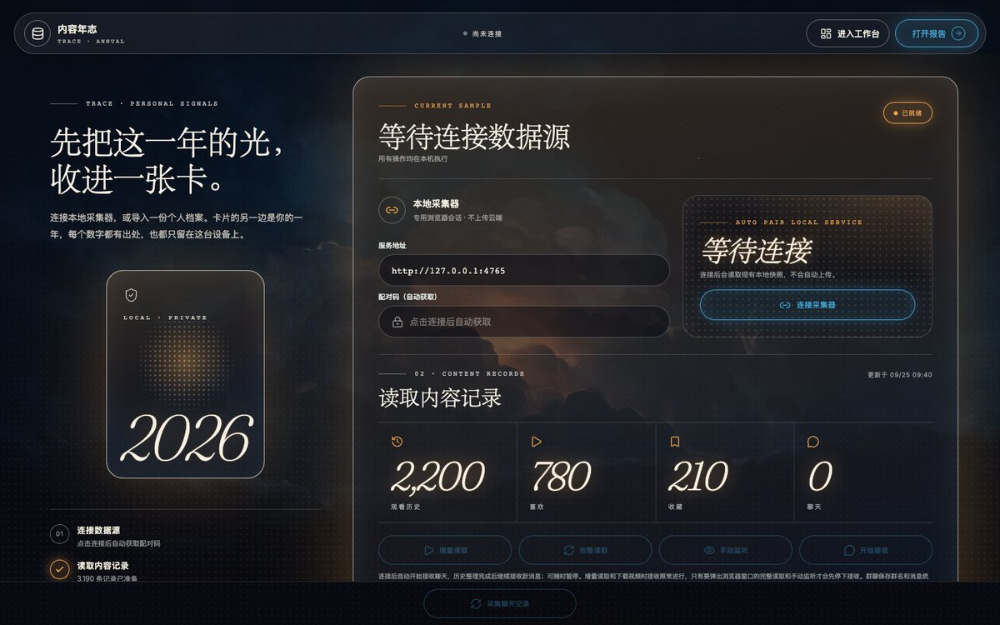
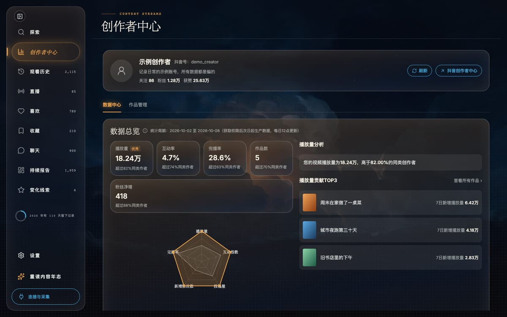
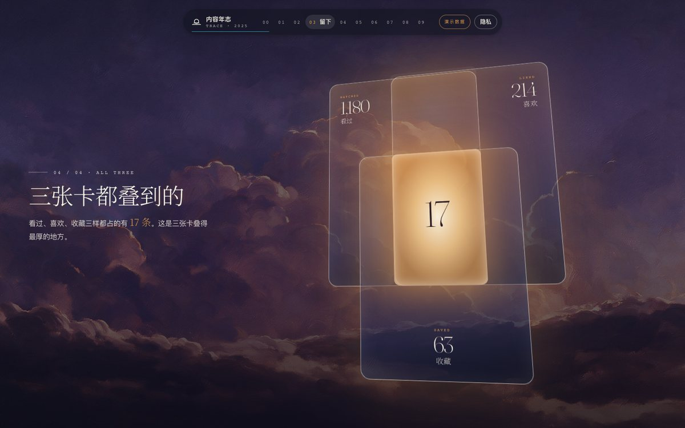
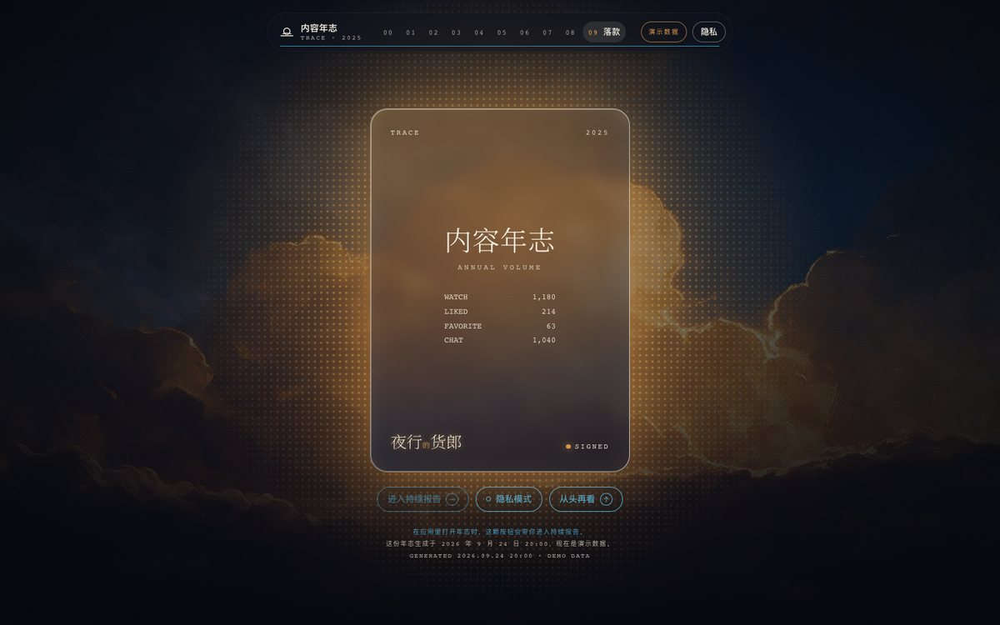
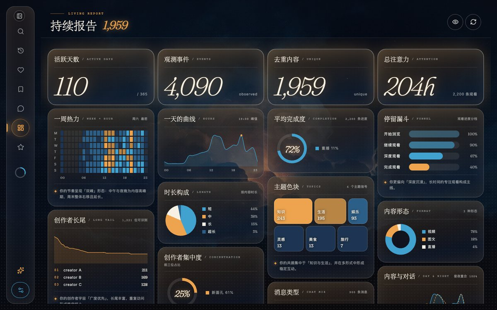
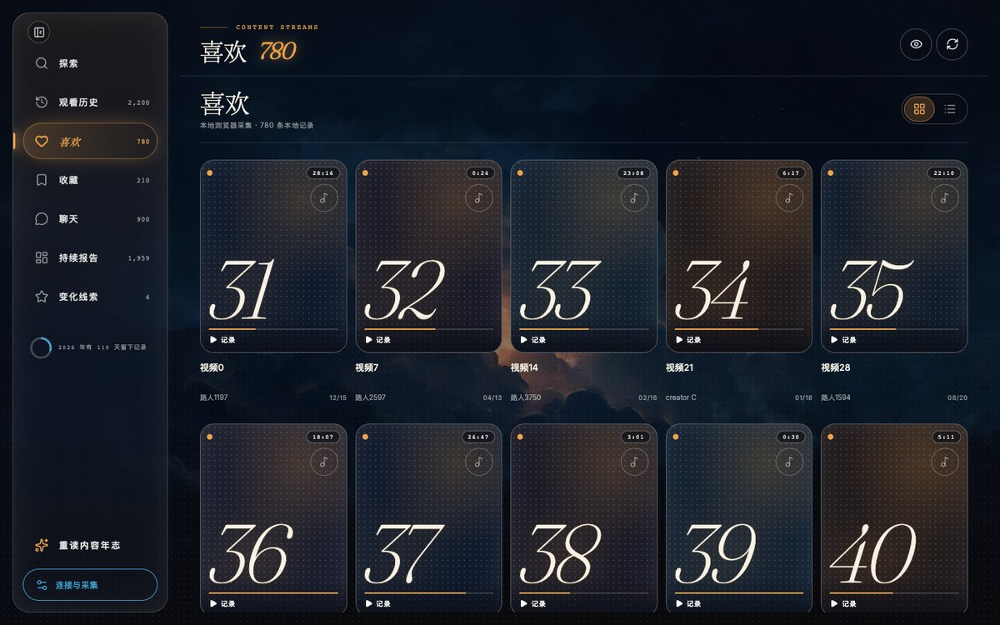
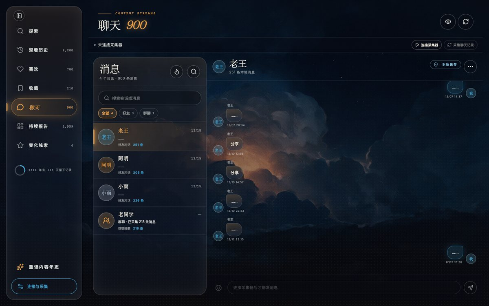
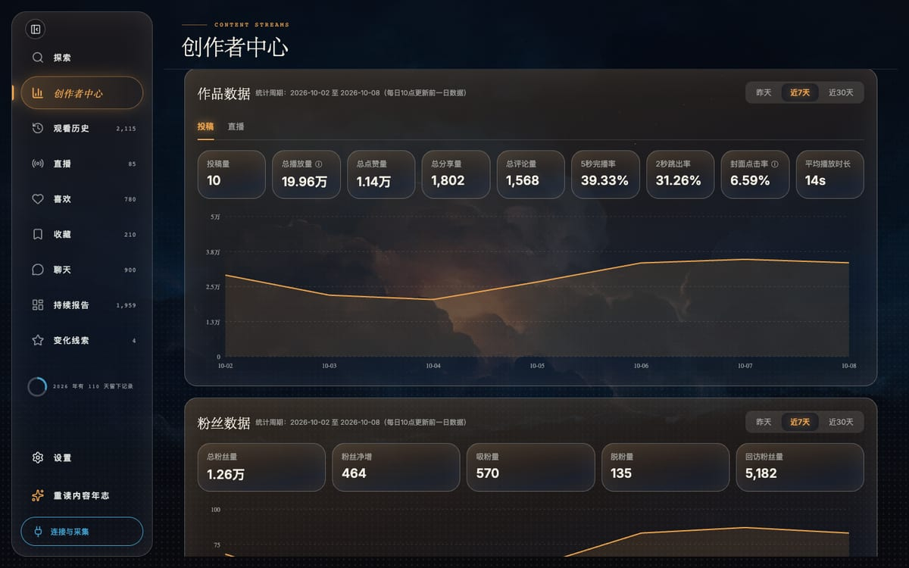
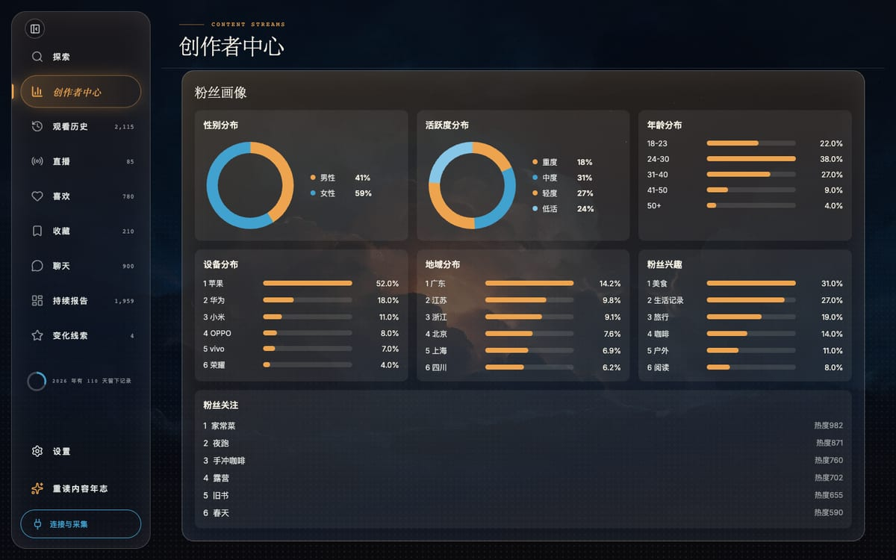

<div align="center">
  <a href="https://github.com/ZhangYukwiver/DouyinDataReview/releases/latest"></a>
  <h1>DouyinDataReview | 抖音内容数据工作台</h1>
  <p><strong>把你的抖音数据，留在自己的电脑上</strong></p>
  <p>DouyinDataReview（内容数据工作台）是一个<strong>免费开源</strong>的抖音数据采集桌面应用：把你自己的抖音观看历史、喜欢、收藏和聊天记录读到本机离线保存，聊天可实时接收，还能续火花、批量下载视频；<br>
  同时在工作台里看自己的创作者中心数据（数据总览、作品数据、粉丝画像、评论分析）和抖音热点榜、抖音指数；攒够了数据，也能随时生成抖音年度报告。支持 Windows 和 macOS，MIT 许可。</p>
  <p>不接外部 AI：标题、作者、封面、Cookie 和报告都不会发送到任何外部分析服务。</p>
  <p>问题反馈与交流请联系 QQ 940537208，或加入 QQ 群 DDDouyin（群号 1124211302），见<a href="#交流与反馈">交流与反馈</a>。</p>
  <p>
    <a href="https://github.com/ZhangYukwiver/DouyinDataReview/releases/latest"></a>
    <a href="https://github.com/ZhangYukwiver/DouyinDataReview/blob/main/LICENSE"></a>
    <a href="https://github.com/ZhangYukwiver/DouyinDataReview/actions/workflows/desktop-release.yml"></a>
    <a href="https://github.com/ZhangYukwiver/DouyinDataReview/stargazers"></a>
    <a href="https://github.com/ZhangYukwiver/DouyinDataReview/releases"></a>
    <a href="https://github.com/ZhangYukwiver/DouyinDataReview/network/members"></a>
    <a href="#交流与反馈"></a>
  </p>
</div>

<table>
  <tr><td></td><td></td></tr>
</table>

<p align="center"><sub>连接与采集、创作者中心。截图都是合成示例数据。</sub></p>

<p align="center"><a href="https://github.com/ZhangYukwiver/DouyinDataReview/releases/latest">下载桌面版</a> · <a href="https://zhangyukwiver.github.io/DouyinDataReview/">国内下载（加速线路）</a> · <a href="https://zhangyukwiver.github.io/DouyinDataReview/#demo">在线看示例报告</a> · <a href="#面向开发者">从源码运行</a> · <a href="https://github.com/ZhangYukwiver/DouyinDataReview/stargazers">觉得有用就 Star</a></p>

> **先看什么？** 想安装，直接打开[最新 Release](https://github.com/ZhangYukwiver/DouyinDataReview/releases/latest)；想了解实现，查看[面向开发者](#面向开发者)；想比较另一种视觉风格，继续看下面的[年度回顾](#年度回顾)。

> [!NOTE]
> 本机需要已安装 Chrome、Edge、Brave 或 Chromium 中的任意一个（Windows 自带的 Edge 即可；macOS 上也能自动识别 Comet）。工具只读取你本人登录账号在网页端当前可见的记录；增量读取走的是抖音未公开承诺的私有接口，可能失效或触发账号风控，只用于本机个人账号。

## 主要功能

- 本地读取观看历史、喜欢、收藏和聊天记录，默认无界面增量更新；关掉窗口后留在托盘（macOS 菜单栏）里，每 3 小时补读一次，可选开机后台运行；能存多个抖音账号，各自的登录和记录分开放，随时切换
- 聊天实时接收，能直接回复好友和群、看好友在线状态；续火花看板读抖音官方火花天数，还能一键给勾选的人续火花
- 内容库按记录浏览，能按标题、作者、话题或音乐搜索，看过的直播单独一栏；视频可下载到本地、在应用内播放，播放时能看评论、发评论、转发给好友
- 创作者中心：在工作台里看自己账号的数据总览、作品数据、粉丝数据与画像，以及每条作品的流量、观众和评论分析，字段和抖音创作者中心网页一致；只读
- 探索工作台：复用登录会话搜索用户与内容，可点赞、收藏、关注、评论；进用户主页能下载作品，也能多选批量打包成 ZIP；首页显示抖音实时热点和飙升热点两个榜，点一个热点就去搜它；进用户主页还会显示 TA 在抖音指数里的达人详情：新增点赞、涨粉这些核心指标和逐日趋势、近 30 天作品、粉丝画像（读的是创作者平台里的官方数据，只读）
- 在工作台里看直播：弹幕实时滚动，能调透明度、字号、速度、显示区域和屏蔽词；直播页顶上列出关注的人谁正在播。只看不发，不发弹幕、不送礼物、不点赞
- 界面默认是白底细线的极简风格；「设置」里集中放着界面风格、自动补读、隐私模式、账号、导出清除和应用更新
- 持续报告：默认看最近 30 天，和上一段比较变化
- 年度回顾：内容年志和海报两种风格，读的是同一份本地汇总

## 年度回顾

在「设置」的「界面风格」里挑一种，再点「打开报告」。风格同时决定采集器页和工作台的样子；默认的极简风格只管这两页，没有单独的报告页，打开报告时用设置里选的一套。

- **内容年志**（默认）：先看到一张入口卡，写着观看、喜欢、收藏、聊天各有多少条；点卡片穿过去，是一卷十章的夜色长卷，天色随章节在五个时辰的油画之间变换。
- **海报**：墨黑、新闻纸配信号橙的展览海报，十章硬切长卷，就是下面演示视频中的一种视觉风格。

https://github.com/user-attachments/assets/f4dd2420-121d-49b7-ba37-c632c03f10ec

<p align="center"><sub>海报风格的年度回顾，从封面一路滚到落款。视频和截图都是合成示例数据；这是可切换的其中一种视觉风格。</sub></p>

<table>
  <tr><td></td><td></td></tr>
  <tr><td></td><td></td></tr>
  <tr><td></td><td></td></tr>
</table>

> 报告只用记录里明确带着的作者、话题、音乐、时长和互动数，不接外部 AI 推测兴趣，也不做心理诊断。视频的「词条」只取显式话题标签；聊天高频词用浏览器内置的 `Intl.Segmenter` 分词，先剔除平台模板消息，群聊正文不参与。

<details>
<summary>工作台截图：连接与采集、持续报告、内容库、聊天、创作者中心（点击展开）</summary>

<table>
  <tr><td></td><td></td></tr>
  <tr><td></td><td></td></tr>
  <tr><td></td><td></td></tr>
</table>

连接与采集页点「连接采集器」会自动取配对码；内容库的卡片可以下载视频、在应用内播放；聊天页的新消息实时进来，列表头的火苗按钮打开续火花看板，群聊打开时从抖音网页现读消息；创作者中心里能看数据总览、作品数据、粉丝数据和粉丝画像，字段和抖音创作者中心网页一致。

</details>

## 支持平台与设备

| 平台 | 设备 / 架构 | 安装包 |
| --- | --- | --- |
| Windows | x64 | `DouyinDataReview-Setup-<version>.exe`（NSIS 安装器） |
| macOS | Apple Silicon（arm64） | `DouyinDataReview-<version>-arm64.dmg` |

两个安装包都没有开发者签名，首次打开的处理方式见下面「快速开始」。手机端通过同一局域网连接电脑上的采集器使用，见[面向开发者](#面向开发者)末尾的[手机连接](#手机连接)小节。

## 快速开始

1. 打开[最新 Release](https://github.com/ZhangYukwiver/DouyinDataReview/releases/latest)，按上表下载对应安装包。

   **macOS 首次打开前需在终端执行一次 `xattr -cr "/Applications/内容数据工作台.app"`，否则会提示应用已损坏；Windows 可能出现 SmartScreen 提示，点「更多信息」，再点「仍要运行」。**

2. 启动「内容数据工作台」，点击「连接采集器」。应用会从本机采集器自动取一次性配对码完成连接，之后默认在前台自动读取新记录，也可以手动点「增量读取」。关掉窗口应用会留在托盘里接着每 3 小时读一次，要完全退出就在托盘图标的菜单里点「退出」。
3. 首次连接时独立浏览器还没登录，会自动开始一次完整读取并弹出浏览器窗口，在里面登录自己的抖音账号；登录后自动继续，之后整理聊天历史并保持实时接收。
4. 进入内容库，在观看历史、喜欢、收藏、聊天和持续报告之间切换；在「设置」里换界面风格、选报告用哪一套，点「打开报告」看年度回顾。

> 安装包只含应用代码、Web 页面和已校验的签名器，不含本地记录、登录状态或浏览器配置。采集记录保存在 macOS 的 `~/Library/Application Support/内容数据工作台/collector/` 或 Windows 当前用户的应用数据目录，升级不会覆盖。
>
> 桌面版启动后会检查 GitHub Release，有新版本时在「设置」里下载，下载完点「重启并安装」；采集进行中不会自动重启。

出了问题，先看[常见问题](#常见问题)；要从源码跑、自己打包或用手机连，看[面向开发者](#面向开发者)。

## 本地数据与接口

<details>
<summary>数据放在哪、本地接口和不落盘的内容（点击展开）</summary>

### 数据放在哪

从源码运行时数据在项目里的 `.local-data/`（已被 git 忽略）；桌面版在 macOS 的 `~/Library/Application Support/内容数据工作台/collector/` 或 Windows 当前用户的应用数据目录。

- 独立浏览器配置目录：`.local-data/browser-profile/`，保存着抖音登录态
- 直接读取模板：`.local-data/direct-history-template.json`，只含浏览器标识和白名单里的查询参数，不含 Cookie
- 归一化记录：`.local-data/records.json`
- 多账号：上面这几样属于第一个账号；之后添加的账号各自在 `.local-data/accounts/<12 位编号>/` 下有自己的 `browser-profile/`、`records.json` 和直接读取模板。账号列表在 `.local-data/accounts.json`，记着各账号的昵称、头像和抖音 uid
- 签名器：从源码运行时在 `.local-data/direct-signer/`，所有账号共用；桌面安装包里已内置校验过的签名器
- 内容年志会把一份汇总快照写入浏览器本地（条数、按天与按小时的分布、交集、话题与创作者排行、聊天形态、高频词条等，不含原始记录、Cookie 或 Token），再以应用内同源页面打开入口卡
- 「清除本地记录」只删当前账号的本地归一化记录和汇总快照，不清除登录状态，也不修改抖音账号里的观看、点赞或收藏状态

### 本地接口

本地服务默认监听 `127.0.0.1:4765`。

| 路径 | 作用 |
| --- | --- |
| `/v1/health` | 健康检查 |
| `/v1/pairing-code` | 仅向本机回环连接返回一次性配对码 |
| `/v1/pair` | 完成配对 |
| `/v1/sync` · `/v1/sync/stop` | 启动完整页面同步 · 停止当前读取 |
| `/v1/chat/observe` · `/v1/chat/observe/stop` | 开始聊天实时接收 · 暂停接收 |
| `/v1/chat/send` | 只在你点击发送或开始一键续火花时，在正在接收的抖音聊天页里输入并发出一条好友或群消息 |
| `/v1/chat/messages` | 打开群聊或往上翻时，从正在接收的抖音聊天页现读群消息，不落盘 |
| `/v1/chat/streaks` | 读抖音网页里各会话的官方火花天数和状态，不落盘 |
| `/v1/explore/*` | 只在你点击探索页或播放器里的操作时，才复用后台会话搜索、读取或互动（点赞、评论、转发等） |
| `/v1/experimental/records-direct` | 只允许本机回环连接。默认的增量读取就走这里：直接读观看历史，喜欢和收藏在后台无界面采集 |
| `/v1/live/rooms` | 只在你打开直播间时启动：POST 进房（在后台会话里开一个直播页），GET 取新弹幕和在线人数，DELETE 退出 |
| `/v1/live/following` | 读关注的人里谁正在直播，结果缓存 30 秒，不落盘 |
| `/v1/creator/read` | 只在你打开创作者中心页、或在探索页打开热点榜、进用户主页（读 TA 的达人详情）时，在后台会话里读一批白名单内的创作者平台查询接口，不落盘；热点榜的响应是加密的，在本机解开 |
| `/v1/downloads` | 只在你点下载或播放时启动。下载会用无头会话把视频取回本地；播放只解析视频地址，不落盘。DELETE 释放播放任务 |
| `/v1/downloads/:id/stream` | 播放器边下边播用的转发地址，凭每个播放任务单独的 key 访问，不带登录令牌；任务释放后立即失效 |
| `/v1/observe` · `/v1/observe/stop` | 打开独立浏览器手动监听 · 停止监听 |
| `/v1/status` · `/v1/records` | 读取状态与归一化记录，DELETE 清除本地记录；清除和 `/v1/records/import` 可带 `?account=<id>`，采集器已切到别的账号时返回 409 `account_changed`，不动记录 |
| `/v1/accounts` · `/v1/accounts/:id/activate` · DELETE `/v1/accounts/:id` | 列出账号、新建并切换过去（201）· 切换 · 删除不在用的账号；读取、手动监听、存文件的下载、探索进行中或正在切换时返回 409 |
| `/v1/browser/close` | 关闭独立浏览器 |

应用内取视频、读评论和用探索页时，会先禁止远端自动播放并拦截观看历史写入，视频只在应用内播放。

### 不落盘的内容

- 12 小时会话 Token 只保存在应用内存和请求头中，不进入 URL 或本地存储。
- 原始响应、请求头、Cookie、签名和完整诊断 URL 不会写入记录文件。
- 群聊消息和官方火花数据都是用的时候从网页现读，不写入记录文件。
- 直播弹幕只在采集器内存里留最近 300 条，退出直播间就没了。

</details>

## 常见问题

### 有没有像 Spotify Wrapped 那样的抖音年度报告？

有。DouyinDataReview 用你本机保存的观看、喜欢、收藏和聊天记录生成抖音年度报告，不用等平台发，随时都能打开，还能存成 3:4 的分享图。报告有内容年志、海报等几种视觉风格，不装软件也可以先[在线看示例报告](https://zhangyukwiver.github.io/DouyinDataReview/#demo)（里面是编出来的演示数据）。

### 怎么导出抖音观看历史和聊天记录？

装好 DouyinDataReview，连上采集器并登录抖音网页版，等读取完成后在「设置」里点「导出数据」。观看历史、喜欢、收藏和好友聊天记录会一起存成一个 JSON 文件。换电脑时在新电脑的采集器页「选择文件」导入，再点「并入本机记录」就能接着用。群聊消息是打开时从网页现读的，不在导出文件里。

### 已经用抖音官方「个人信息下载」导出过数据，能直接用吗？

能。在采集器页「或者导入个人档案」那里点「选择文件」，选官方导出的 JSON 或 ZIP，就能用这份档案生成报告，不用登录。导入的文件只在这次打开时读取，关掉应用后要重新导入。

### 能批量下载抖音里喜欢和收藏的视频吗？

能。内容库里点「批量下载」进入多选，选好的视频会打包成 ZIP 存到本机；探索页进到某个用户的主页，也能单条或多选下载这个用户的作品。图文作品会下载全部图片。

### 收费吗？数据会传到哪里？

免费，源码以 MIT 许可开源。读到的记录只存在你自己的电脑上，不接外部 AI，也不发给任何统计或分析服务。

### 会被封号吗？

没法保证不会。工具用的是你自己在抖音网页版登录的会话，读的是你本人能看到的记录；但增量读取走的是抖音没有公开承诺的接口，可能失效，也可能触发风控。建议只在自己的账号上用，别拿它批量操作别人的账号或群发消息。

### macOS 打开时提示应用已损坏？

安装包没有开发者签名。在终端执行一次 `xattr -cr "/Applications/内容数据工作台.app"`，再打开就行。

### Windows 弹出 SmartScreen？

点「更多信息」，再点「仍要运行」。

### 提示「未找到 Chrome、Edge、Brave 或 Chromium 浏览器」？

装上 Chrome、Edge、Brave 或 Chromium 中的任意一个（Windows 自带的 Edge 即可；macOS 上也能自动识别 Comet）；浏览器装在非默认位置时，可用环境变量 `DOUYIN_CHROME_PATH` 指定可执行文件路径。

### 首次连接弹出浏览器窗口，正常吗？

正常。独立浏览器还没登录时，会自动开始一次完整读取并弹出窗口让你登录；登录后自动继续。

### 已连接却提示「尚未捕获直接读取模板」？

请从[最新 Release](https://github.com/ZhangYukwiver/DouyinDataReview/releases/latest)升级至 v0.1.1 或更新版本。旧版手动监听可能保存了记录，却没有建立增量读取所需的配置。新版会在监听观看历史时保存配置；增量读取缺少配置或配置失效时，会自动尝试一次完整读取。若仍提示初始化失败，点击「完整读取」，在专用浏览器中登录并等待观看历史加载完成。升级会保留本地记录。

### 报告是空的，或提示「报告有更新」？

采集进行中也能打开报告，这时数据可能还不全；采集结束后会提示「报告有更新」并换成新数据。持续报告在最近 30 天样本不足时会自动回退到 90 天。

### 火花天数和抖音里显示的对不上？

开着聊天接收时，看板里亮着的火花读的是抖音网页里的官方天数，应该和抖音里一致。没在接收时才按本机保存的聊天记录估算：同一天双方都发过消息才算一天，连着聊满 3 天点亮，断一天清零。抖音没公开自己的算法，本地也只有采集到的那部分记录，所以估算只当参考；想改口径可以改源码 `src/domain/chatSparks.ts` 里的 `SPARK_LIT_DAYS` 等常量。

### 探索页提示需要登录或验证？

去「手动监听」里，在独立浏览器中把登录或验证做完，再回到探索页。

### 手机连不上？

电脑端启动采集器时要加 `--lan`，并用 `--origin` 写上手机实际打开的页面地址；手机上把服务地址改成采集器显示的局域网地址。完整命令见[手机连接](#手机连接)。

### 还有别的问题？

到 [Issues](https://github.com/ZhangYukwiver/DouyinDataReview/issues) 或 QQ 群提问，见[交流与反馈](#交流与反馈)。

## 面向开发者

```bash
# 1. 克隆项目并安装依赖
git clone https://github.com/ZhangYukwiver/DouyinDataReview.git
cd DouyinDataReview
npm install

# 2. 安装并离线校验固定版本的签名器（增量读取需要）
npm run direct:setup
npm run direct:check

# 3. 启动采集器（终端 A）
npm run collector

# 4. 启动 Web 页面（终端 B），然后打开 http://localhost:8081 点「连接采集器」
npm run web
```

页面与采集器在同一台电脑时会自动获取并填入 8 位一次性配对码。

其他开发方式：

- macOS 一键启动：`npm run app:mac` 生成 `抖音年度回顾.app`，双击即可在后台启动采集器和页面；保持它与项目在同一目录，首次打开时允许访问「文稿」文件夹，从 Dock 退出会停止它启动的本地服务。它每次启动都会先跑一次 `expo export` 重新生成 `dist/` 再伺服，所以应用源码改动重开应用就能生效（每次启动都要先等一会儿构建）；但它不经过 `npm run build:web`，改了 `prototype/` 里的内容年志要先 `npm run sync:story`。
- Windows 桌面开发版：`npm run desktop` 会构建 Web 页面并启动 Electron 和仅监听本机的内置采集器。
- 进程看护：`npm run watch:process -- npm run web` 按秒采样子进程树，CPU 持续超过 500% 或 RSS 超过 2 GB 时自动停止。
- 验证：`npm run typecheck`、`npm test`、`npm run build:web`。
- 内容年志的源文件在 `prototype/`，改完运行 `npm run sync:story` 同步到 `public/story/`（`npm run build:web` 会自动同步）。

<details>
<summary>打包 exe / dmg 安装包，适合要自己出包的开发者查阅（点击展开）</summary>

**Windows（NSIS 安装器）**

```bash
npm run desktop:build
```

输出到 `release/DouyinDataReview-Setup-<version>.exe`，带桌面和开始菜单快捷方式。

**macOS（DMG）**

```bash
npm run desktop:build:mac
```

在 Apple Silicon Mac 上输出 `release/DouyinDataReview-<version>-arm64.dmg`。没有 Apple 开发者签名时会做 ad-hoc 签名，拿到 dmg 的人首次打开前仍要执行上面的 `xattr -cr`。

</details>

### 手机连接

电脑和手机要在同一个可信局域网。启动采集器时加 `--lan` 打开局域网访问，再用 `--origin` 写上手机实际打开的页面地址：

```bash
npm run collector -- --lan --origin http://192.168.1.20:8081
```

应用中把服务地址改为采集器显示的局域网地址，例如 `http://192.168.1.20:4765`。LAN 模式仍使用一次性配对码和内存会话，但流量是局域网 HTTP，只应在可信网络使用。

## 安全说明

1. **仅限个人使用**：此工具只读取你本人登录账号当前可见的记录，发消息、点赞、评论、转发等操作也只在你手动点击时进行（一键续火花也要你勾好对象、点开始才发这一轮，不做定时）；请勿用于他人账号，也别拿它群发营销或刷屏
2. **登录态安全**：独立浏览器配置目录保存着抖音登录 Cookie，请妥善保管，不要拷贝或分享给他人
3. **数据隐私**：本地记录和聊天快照包含个人隐私信息，请谨慎处理；仓库和安装包本身不含任何数据
4. **合法使用**：请遵守相关法律法规和平台规则，不得用于非法目的

## 免责声明

> [!IMPORTANT]
> 请在充分理解以下内容，并自愿承担相应责任的前提下使用本项目：
>
> 1. **项目性质**
>
>    本项目为独立开发的非官方开源工具，与抖音、字节跳动及其关联主体不存在隶属、授权、合作或认可关系。相关产品名称和商标归其权利人所有。
>
> 2. **合法使用**
>
>    本项目仅可用于处理使用者本人合法持有、管理或已经取得明确授权访问的数据。使用者应遵守适用的法律法规、软件许可协议、平台规则和隐私保护义务。
>
> 3. **数据与备份**
>
>    使用过程涉及本地记录、浏览器登录态、聊天快照和下载的视频文件。开始前请备份重要数据，并自行负责登录态保管、数据安全和隐私保护。
>
> 4. **兼容性与运行风险**
>
>    抖音页面结构、接口格式或风控策略变化，可能导致读取失败、功能失效、账号提醒或其他不可预期结果。本项目不保证对未来抖音版本持续兼容。
>
> 5. **责任范围**
>
>    本项目按现状提供，不对功能的准确性、完整性、稳定性或持续可用性作出明示或默示保证。在适用法律允许的范围内，因使用、误用、版本不兼容、操作中断或第三方策略变化产生的损失和后果，由使用者自行承担。
>
> 使用或继续使用本项目，即表示使用者已经阅读、理解并同意以上内容，并愿意对自己的操作及其结果负责。

## English

DouyinDataReview is a local-first desktop app for Windows and macOS that works with Douyin, the Chinese version of TikTok. It reads your own watch history, likes, favorites and chat messages through the Douyin web client, keeps everything on your computer, and turns it into a rolling report and a year-in-review (a "Douyin Wrapped"). You can also export all records as JSON, receive chats in real time, keep chat streaks going, play and download videos, and view your Creator Center stats read-only. Nothing is sent to an external AI or analytics service. The interface is in Chinese. Get the installer from [Releases](https://github.com/ZhangYukwiver/DouyinDataReview/releases/latest); Chrome, Edge, Brave or Chromium must be installed.

- **Is there a Douyin Wrapped?** DouyinDataReview builds a Wrapped-style year-in-review from your own records on your computer, any time you want; you can [preview a demo report](https://zhangyukwiver.github.io/DouyinDataReview/#demo) in the browser without installing anything.
- **How do I export my Douyin watch history?** Install DouyinDataReview, connect the collector, sign in to Douyin web, and after the sync finishes click 导出数据 (Export data) in Settings. Watch history, likes, favorites and friend chats are saved to one JSON file.
- **Can it read the official Douyin data download?** Yes. Import the JSON or ZIP from Douyin's 个人信息下载 (personal data download) to generate a report without signing in.
- **Is it free and private?** Yes. It is MIT-licensed. Your records stay on your computer and are never sent to an external AI or analytics service.

## 交流与反馈

| 渠道 | 怎么用 |
| --- | --- |
| [GitHub Issues](https://github.com/ZhangYukwiver/DouyinDataReview/issues) | 报 bug、提需求，公开有记录，遇到过同样问题的人也能回答你 |
| QQ 群「DDDouyin」 | 群号 1124211302，讨论与互助 |
| QQ | 940537208，问题反馈与交流直接联系 |

提问前先看一遍[常见问题](#常见问题)，并附上出问题时的操作步骤和系统版本，能省掉来回追问。

<p align="center"></p>

## 致谢

1. **[mafqla/douyin-api](https://github.com/mafqla/douyin-api)** — 固定版本签名器
2. **[Expo](https://github.com/expo/expo)** / **[React Native](https://github.com/facebook/react-native)** / **[react-native-web](https://github.com/necolas/react-native-web)** — 工作台页面与原生端
3. **[Electron](https://github.com/electron/electron)** / **[electron-builder](https://github.com/electron-userland/electron-builder)** — 桌面壳与安装包
4. **[Playwright](https://github.com/microsoft/playwright)** — 驱动独立浏览器与无头会话
5. **[lucide](https://github.com/lucide-icons/lucide)** — 图标

没有这些项目，这个工具做不出来，谢谢他们。

## 贡献

发现 bug、有功能诉求、觉得操作繁琐或界面不好看，都欢迎提 [Issue](https://github.com/ZhangYukwiver/DouyinDataReview/issues)；想动手改的话，fork 后发 [Pull Request](https://github.com/ZhangYukwiver/DouyinDataReview/pulls) 就行。

<a href="https://github.com/ZhangYukwiver/DouyinDataReview/graphs/contributors"></a>

## Star History

<picture>
  <source media="(prefers-color-scheme: dark)" srcset="https://api.star-history.com/svg?repos=ZhangYukwiver/DouyinDataReview&type=Date&theme=dark" />
  <source media="(prefers-color-scheme: light)" srcset="https://api.star-history.com/svg?repos=ZhangYukwiver/DouyinDataReview&type=Date" />
  
</picture>

<p align="center"><strong>请负责任地使用本工具，遵守相关法律法规。</strong></p>
