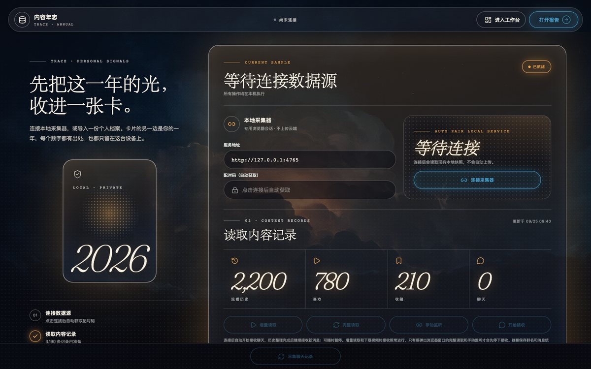
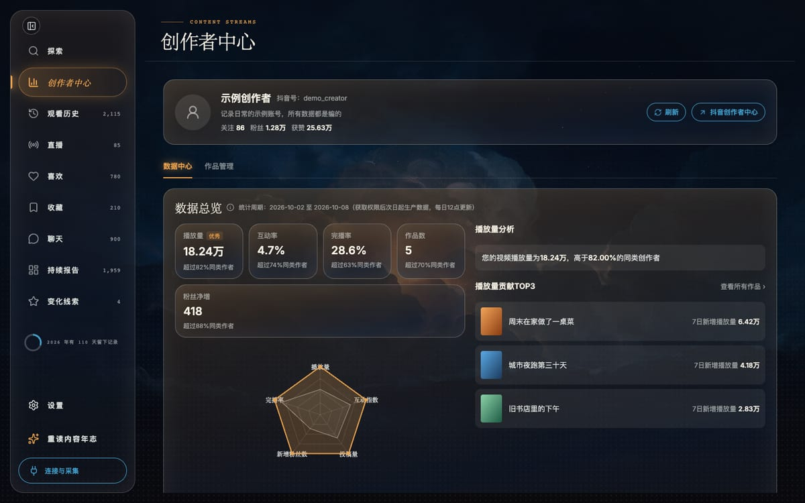
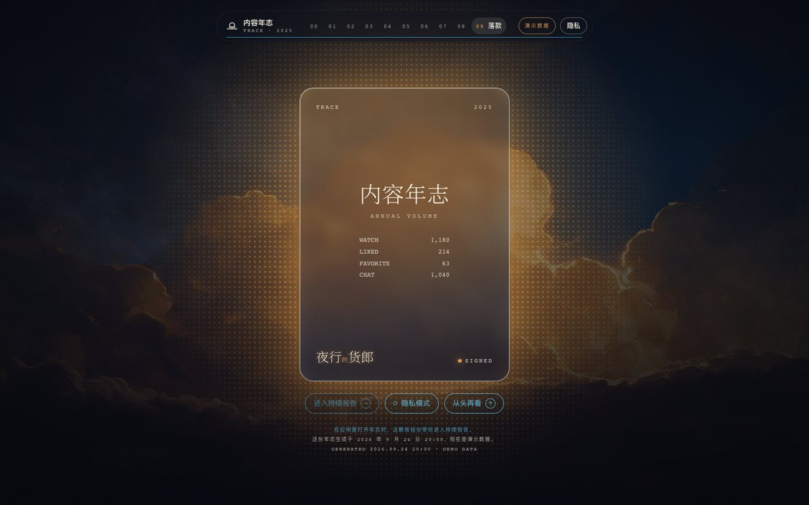
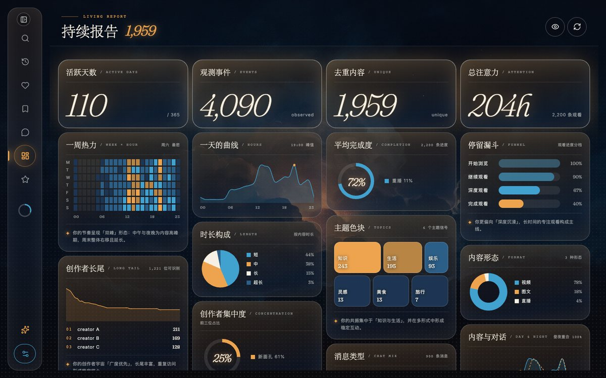
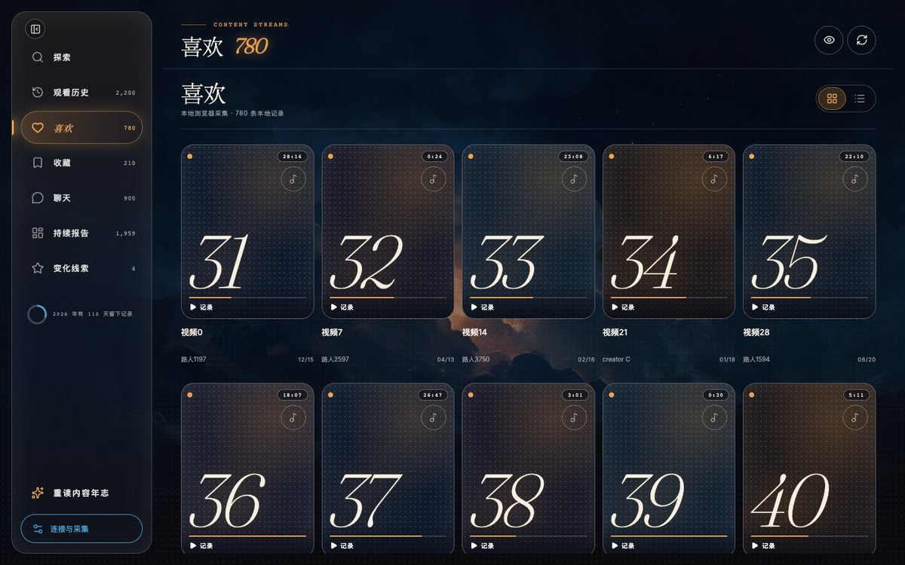
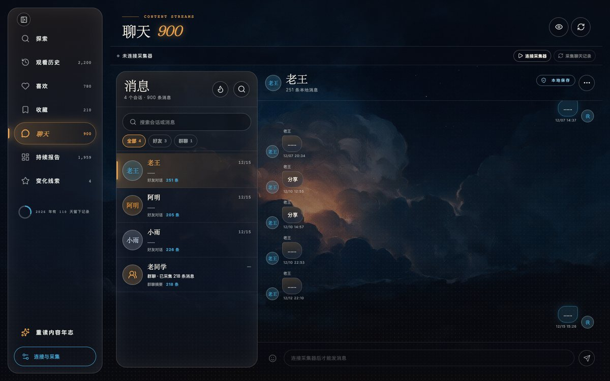
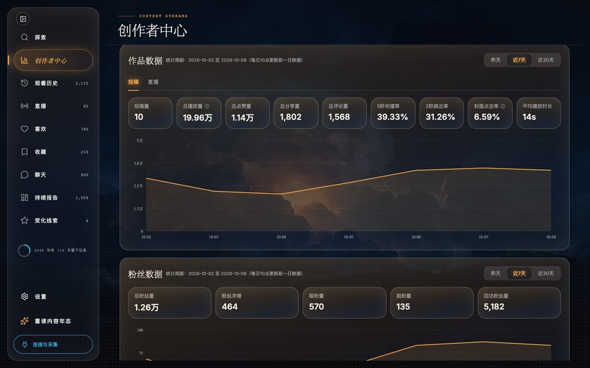
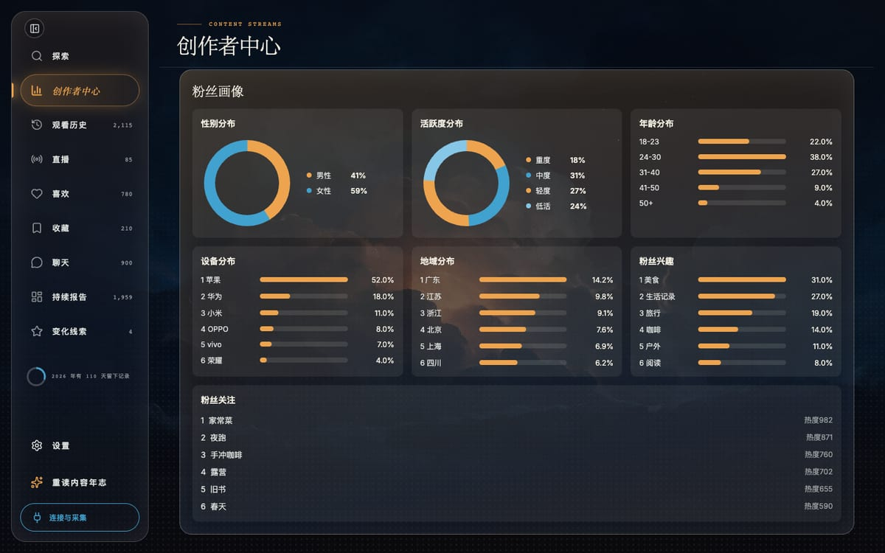

<div align="center">
  <a href="https://github.com/ZhangYukwiver/DouyinDataReview/releases/latest"></a>
  <h1>DouyinDataReview | 抖音数据导出与年度报告工作台</h1>
  <p><strong>把你的抖音数据，留在自己的电脑上</strong></p>
  <p>导出观看历史与聊天记录，在电脑上刷抖音推荐，管理喜欢和收藏、批量下载视频，生成自己的抖音年度回顾。<br>
  免费开源 · Windows / macOS / Linux · 本地保存 · MIT 许可</p>
  <p>问题反馈与交流请联系 QQ 940537208，或加入 QQ 群 DDDouyin（群号 1124211302），见<a href="#交流与反馈">交流与反馈</a>。</p>
  <p>
    <a href="https://github.com/ZhangYukwiver/DouyinDataReview/releases/latest"></a>
    <a href="https://github.com/ZhangYukwiver/DouyinDataReview/blob/main/LICENSE"></a>
    <a href="https://github.com/ZhangYukwiver/DouyinDataReview/actions/workflows/desktop-release.yml"></a>
    <a href="https://github.com/ZhangYukwiver/DouyinDataReview/stargazers"></a>
    <a href="https://github.com/ZhangYukwiver/DouyinDataReview/releases"></a>
    <a href="https://github.com/ZhangYukwiver/DouyinDataReview/network/members"></a>
    <a href="#交流与反馈"></a>
  </p>
</div>

<table>
  <tr><td></td><td></td></tr>
</table>

<p align="center"><sub>连接与采集、创作者中心。截图都是合成示例数据。</sub></p>

<p align="center"><a href="https://github.com/ZhangYukwiver/DouyinDataReview/releases/latest">下载桌面版</a> · <a href="https://zhangyukwiver.github.io/DouyinDataReview/">国内下载（加速线路）</a> · <a href="https://zhangyukwiver.github.io/DouyinDataReview/#demo">在线看示例报告</a> · <a href="#面向开发者">从源码运行</a> · <a href="https://github.com/ZhangYukwiver/DouyinDataReview/stargazers">觉得有用就 Star</a></p>

**DouyinDataReview 是一款免费开源的抖音数据采集、导出与分析桌面应用。** 它用你本人登录的抖音会话读取观看历史、喜欢、收藏和好友聊天记录，保存在本机，并生成持续报告和抖音年度报告（Douyin Wrapped）。工作台还能在电脑上刷抖音推荐、按关键词屏蔽视频、下载视频、实时聊天、看创作者中心和直播，另有可选的 AI 助手。

只支持抖音（中国版），不支持国际版 TikTok；提供 Windows x64、macOS Apple Silicon 和 Linux x64 安装包。本项目是独立开发的非官方工具，与抖音、字节跳动及其关联主体不存在隶属、授权、合作或认可关系。完整步骤见[数据导出与年度报告使用指南](https://zhangyukwiver.github.io/DouyinDataReview/guide.html)，给检索工具读的项目事实在 [llms.txt](llms.txt)。

> [!NOTE]
> 只能读到本人账号在接口当前返回的记录，不保证取回全部历史。采集用的是抖音没有公开承诺的接口，可能失效，也可能触发账号风控。

## 主要功能

- **采集与导出**：观看历史、喜欢、收藏和聊天记录存在本机，导出 JSON，也能导入抖音官方档案
- **刷视频与内容库**：在电脑上刷抖音推荐，浏览、搜索、批量下载自己的记录
- **聊天与续火花**：实时收发消息，一键续火花
- **创作者中心、探索与直播**：看自己的作品和粉丝数据（能导出表格）、热点榜、关注的人的直播
- **推荐流控制**：按关键词屏蔽不想看的视频，把想看的词条混进推荐，软件和网页都能用
- **AI 助手（可选）**：用对话查数据、替你操作，Claude Code、Codex 可通过 MCP 接入
- **年度报告**：三种风格，可导出 HTML 和分享图

点赞、评论这些和抖音里一样，默认关着，在「设置 → 隐私」打开。视频解析可在播放器里直接发起。

## 年度回顾

在「设置 → 界面风格」选一种，点「打开报告」：内容年志（默认）是十章夜色长卷，档案馆是可以翻页的暗色星图卷宗，海报是墨黑配信号橙的展览海报。报告只用本机已存的记录，不补造缺失数据，也不接外部 AI。

https://github.com/user-attachments/assets/f4dd2420-121d-49b7-ba37-c632c03f10ec

<p align="center"><sub>海报风格的年度回顾，从封面一路滚到落款。视频和截图都是合成示例数据；这是可切换的其中一种视觉风格。</sub></p>

<table>
  <tr><td></td><td></td></tr>
  <tr><td></td><td></td></tr>
  <tr><td></td><td></td></tr>
</table>

<details>
<summary>工作台截图：连接与采集、持续报告、内容库、聊天、创作者中心（点击展开）</summary>

<table>
  <tr><td></td><td></td></tr>
  <tr><td></td><td></td></tr>
  <tr><td></td><td></td></tr>
</table>

</details>

## 快速开始

1. 从[最新 Release](https://github.com/ZhangYukwiver/DouyinDataReview/releases/latest) 下载安装包：Windows 用 `DouyinDataReview-Setup-<version>.exe`，macOS（Apple Silicon）用 `DouyinDataReview-<version>-arm64.dmg`，Linux x64 用 `DouyinDataReview-<version>-amd64.deb`（Debian / Ubuntu 系）或 `DouyinDataReview-<version>-x86_64.AppImage`。

   **macOS 首次打开前需在终端执行一次 `xattr -cr "/Applications/DouyinDataReview.app"`，否则会提示应用已损坏；Windows 出现 SmartScreen 时点「更多信息」，再点「仍要运行」。**

2. 打开应用，在首屏用抖音 App 扫码并在手机上确认；核对昵称，勾选读取视频、读取聊天，点「确认导入」，读取自动开始。
3. 进工作台默认是刷视频，内容库、聊天和持续报告在侧栏。在「设置」里换风格、导出数据，点「打开报告」看年度回顾。

也可以在「设置 → 账号」从 Chrome / Edge / macOS Comet 导入登录凭据，或直接读本机抖音电脑客户端的登录态。关掉窗口后应用留在托盘，每 3 小时补读一次，完全退出要在托盘菜单里点「退出」。记录存在本机，升级不会覆盖。

## 常见问题

### 有没有像 Spotify Wrapped 那样的抖音年度报告？

有，用本机记录随时生成，能存成分享图；不装软件也能先[在线看示例报告](https://zhangyukwiver.github.io/DouyinDataReview/#demo)。

### 怎么导出抖音观看历史和聊天记录？

读取完成后在「设置 → 数据」点「导出数据」，勾选要导出的类型存成 JSON。

### 能批量下载抖音里喜欢和收藏的视频吗？

能，内容库里点「批量下载」，多选后打包成 ZIP。

### 能在电脑上刷抖音推荐吗？

能，进工作台默认就是「刷视频」，还能把想看的词条混进推荐。

### 能按关键词屏蔽抖音推荐里不想看的视频吗？

能，在「设置 → 推荐流」写好词条，软件里刷视频直接生效，Chrome、Edge 网页装一次扩展。还能把想看的词条混进推荐，或者只看词条。

### 收费吗？数据会传到哪里？

免费开源。记录和报告都在本机，采集只请求抖音；可选的 AI 助手只把对话和它查到的数据发给你自己配置的模型。

### 会被封号吗？

没法保证。用的接口抖音没有公开承诺，可能触发风控，只在自己的账号上用。

### 打开时提示应用已损坏，或弹出 SmartScreen？

安装包没有开发者签名。macOS 在终端执行一次 `xattr -cr "/Applications/DouyinDataReview.app"`；Windows 点「更多信息」，再点「仍要运行」。

### 提示端口被占用，或要求重新登录？

端口 4765 被占用是旧版还在后台，从托盘点「退出」再打开；要求登录或验证就在首屏点「重新扫码登录」。

## 面向开发者

工作台用 React / React Native / Expo 写，本地采集器是 Node.js，桌面壳是 Electron。采集器用导入的登录会话发签名 HTTP 请求、按游标分页读取记录，聊天和直播弹幕走 WebSocket。

```bash
# 1. 克隆项目并安装依赖
git clone https://github.com/ZhangYukwiver/DouyinDataReview.git
cd DouyinDataReview
npm install

# 2. 下载并校验评论回复用的签名器（不装也能用，只是展开不了评论回复）
npm run direct:setup

# 3. 启动采集器（终端 A）
npm run collector

# 4. 启动 Web 页面（终端 B），然后打开 http://localhost:8081 点「连接采集器」
npm run web
```

- 桌面开发版：`npm run desktop`；打安装包：`npm run desktop:build`（Windows）、`npm run desktop:build:mac`（Apple Silicon）或 `npm run desktop:build:linux`（x64，要先装 nasm），输出到 `release/`。
- 验证：`npm run typecheck`、`npm test`、`npm run build:web`。
- 手机连接：电脑和手机在同一可信局域网时，用 `npm run collector -- --lan --origin http://<手机打开的页面地址>` 启动采集器，手机上把服务地址改成采集器显示的局域网地址。

## 免责声明

> [!IMPORTANT]
> - 本项目是独立开发的非官方开源工具，与抖音、字节跳动及其关联主体不存在隶属、授权、合作或认可关系，相关名称和商标归其权利人所有。
> - 只能用来处理你本人合法持有或已取得明确授权的数据。请遵守法律法规和平台规则，不要用于他人账号，也别拿它群发或刷屏。
> - 数据目录里存着登录 Cookie 和签名凭据，本地记录含个人隐私，请自行保管，不要分享给他人。
> - 抖音接口或风控策略变化可能导致读取失败、功能失效或账号提醒，本项目不保证持续兼容。
> - 本项目按现状提供，不作任何明示或默示保证；使用产生的损失和后果由使用者自行承担。

## English

**DouyinDataReview is a free, open-source desktop app for exporting and analyzing your own Douyin data on Windows x64, macOS Apple Silicon and Linux x64.** It targets Douyin in China; international TikTok is not supported. It saves watch history, likes, favorites and friend chats locally as JSON, generates rolling reports and a year-in-review ("Douyin Wrapped"), and lets you browse your Douyin feed, block feed videos by keyword, download videos, chat, check Creator Center stats and watch live streams. This is an independent, unofficial project; the interface is in Chinese and the source is MIT-licensed. Download it from [Releases](https://github.com/ZhangYukwiver/DouyinDataReview/releases/latest) and see the [export and privacy guide](https://zhangyukwiver.github.io/DouyinDataReview/guide.html).

- **How does it work?** Scan the Douyin login QR code on the first screen, or import credentials from Chrome / Edge / Comet or the Douyin desktop client. A local Node.js collector then reads your records with signed, paginated HTTP requests, and reports are computed on your computer.
- **Is there a Douyin Wrapped?** Yes, built from your own records whenever you want; [preview a demo report](https://zhangyukwiver.github.io/DouyinDataReview/#demo) without installing anything.
- **How do I export my watch history?** After reading finishes, click 导出数据 (Export data) in Settings → Data and pick what to save as JSON.
- **Can it read the official Douyin data download?** Yes. Import the JSON or ZIP from 个人信息下载 (personal data download) to build a report without signing in.
- **Is it free and private?** Yes. Records and reports stay on your computer and collection only talks to Douyin. The optional AI assistant sends your messages and the data it looks up only to the model API you configure.
- **Limits:** it can only read what Douyin's private APIs currently return for your account, so a complete history and future compatibility are not guaranteed.

## 交流与反馈

| 渠道 | 怎么用 |
| --- | --- |
| [GitHub Issues](https://github.com/ZhangYukwiver/DouyinDataReview/issues) | 报 bug、提需求，公开有记录，遇到过同样问题的人也能回答你 |
| QQ 群「DDDouyin」 | 群号 1124211302，讨论与互助 |
| QQ | 940537208，问题反馈与交流直接联系 |

提问时附上操作步骤和系统版本，能省掉来回追问。

<p align="center"></p>

## 致谢

感谢 [Expo](https://github.com/expo/expo) / [React Native](https://github.com/facebook/react-native) / [react-native-web](https://github.com/necolas/react-native-web)（工作台页面）、[Electron](https://github.com/electron/electron) / [electron-builder](https://github.com/electron-userland/electron-builder)（桌面壳与安装包）、[Playwright](https://github.com/microsoft/playwright)（连接浏览器 CDP 与 HTTP 请求会话）、[lucide](https://github.com/lucide-icons/lucide)（图标）和 [mafqla/douyin-api](https://github.com/mafqla/douyin-api)（评论回复签名，GPL-3.0，固定版本、按原样随安装包附带并保留其许可证）。

## 贡献

欢迎提 [Issue](https://github.com/ZhangYukwiver/DouyinDataReview/issues) 或发 [Pull Request](https://github.com/ZhangYukwiver/DouyinDataReview/pulls)。

<a href="https://github.com/ZhangYukwiver/DouyinDataReview/graphs/contributors"></a>

## Star History

<picture>
  <source media="(prefers-color-scheme: dark)" srcset="https://api.star-history.com/svg?repos=ZhangYukwiver/DouyinDataReview&type=Date&theme=dark" />
  <source media="(prefers-color-scheme: light)" srcset="https://api.star-history.com/svg?repos=ZhangYukwiver/DouyinDataReview&type=Date" />
  
</picture>

<p align="center"><strong>请负责任地使用本工具，遵守相关法律法规。</strong></p>
